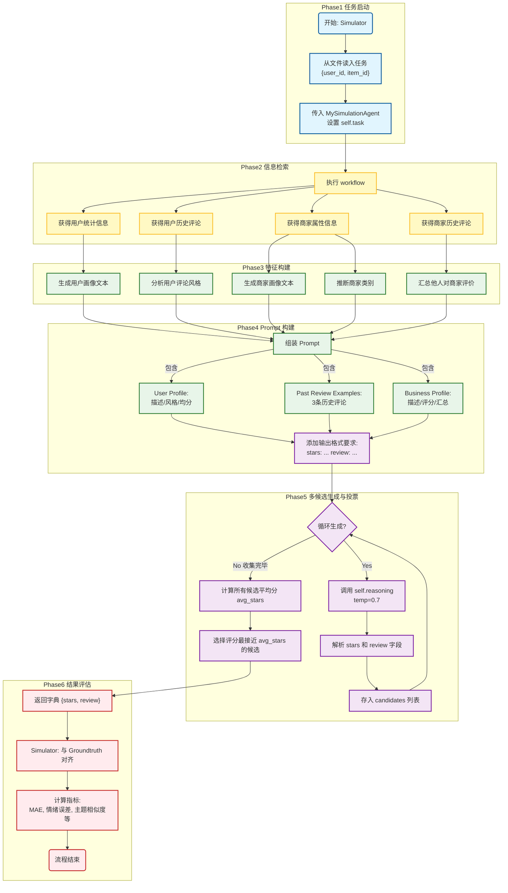

# 用户建模评价 Agent 项目报告  


## 1. 项目背景与任务定义

本项目面向 Agent Society Challenge 中的 **User Modeling Track**。该赛道重点考察参赛者构建基于大语言模型（LLM）的 Agent，对用户在在线平台（如 Yelp）上的评论行为进行模拟。  

在该任务中，每个仿真场景提供：

- **输入**  
  - `User ID`: 需要模拟的目标用户标识  
  - `Item ID`: 要生成评论的目标物品（商家/内容）标识  

- **输出**  
  - `Star/Rating`: 数值评分，反映用户对该物品的整体偏好  
  - `Review Text`: 一段详细、语境相关、风格一致的自然语言评论  

赛题希望通过一系列定量评价指标（星级预测 MAE、情绪向量 MAE、情感态度 MAE、主题相似度等），衡量代理在“用户偏好建模”和“评论文本生成”两方面的能力。

在本项目中，我们在给定的 websocietysimulator 仿真平台上，实现了自定义代理 `MySimulationAgent`（见 simulationAgent.py），并结合工具接口和 LLM 推理逻辑，实现了端到端的用户行为模拟流程。


## 2. 数据与仿真环境

### 2.1 数据来源

项目使用了官方提供的开发数据集  Yelp，其核心信息包括：

- 用户侧：  
  - 历史评论数、被标记为有用/好笑/酷的次数  
  - 精英年份（elite years）  
  - 好友数量或好友列表  
  - 历史打分、历史评论文本  

- 商家侧：  
  - 商家名称、地址、城市、州  
  - 类别标签（categories）  
  - 星级评分（stars）与评论数  
  - 各种业务属性（如是否提供外卖、是否有停车、是否有电视、适合人群等）  

  - 不同用户对该商家的历史评论文本及评分  

在本项目中，我们通过 `Simulator` 提供的 `interaction_tool` 接口统一访问上述数据。


### 2.2 仿真平台与运行入口

在 simulationAgent.py 末尾，我们通过如下流程驱动仿真与评估：

1. 初始化 `Simulator`：

   ```python
   simulator = Simulator(data_dir="./dataset", device="cpu", cache=True)
   simulator.set_task_and_groundtruth(
       task_dir=f"./example/track1/{task_set}/tasks",
       groundtruth_dir=f"./example/track1/{task_set}/groundtruth"
   )
   ```

2. 注册自定义 Agent 与 LLM：

   ```python
   simulator.set_agent(MySimulationAgent)
   simulator.set_llm(InfinigenceLLM(api_key="..."))
   ```

3. 运行仿真与评估：

   ```python
   outputs = simulator.run_simulation(number_of_tasks, enable_threading=True, max_workers=5)
   evaluation_results = simulator.evaluate()
   ```

4. 结合 task、groundtruth、user_info、item_info 将结果保存为 JSON 文件，便于后续分析。


## 3. Baseline 设计实现

Baseline 整体设计采用了**“先理解，后行动”**的策略：首先收集用户和商家的原始数据（属性、历史评论）。利用 LLM 将结构化的原始数据转化为自然语言描述（用户画像、商家概况、评论风格摘要），构建丰富的上下文。将转化后的上下文填入 Prompt，要求 LLM 保持用户的人设和风格，对商家进行评价。

我们的系统采用模块化架构，将复杂任务拆解为 **规划模块、推理模块、记忆模块以及数据获取工具** 等子组件，并通过统一的工作流组织起来。我们设计了继承自基础类 `SimulationAgent ` 的 `MySimulationAgent` 用于，在初始化中注入如下子模块：

- `PlanningBaseline(PlanningBase)`  负责对任务进行粗粒度规划；主要给出一个执行任务的高层计划，其结构为“调用外部工具、分步骤完成任务”的 Agent 思路，为进一步扩展（如多轮交互、主动检索更多上下文）提供了基础。

```python
class PlanningBaseline(PlanningBase):
    def __call__(self, task_description):
        self.plan = [
            {
                'description': 'First I need to find user information',
                'reasoning instruction': 'None',
                'tool use instruction': {task_description['user_id']}
            },
            {
                'description': 'Next, I need to find business information',
                'reasoning instruction': 'None',
                'tool use instruction': {task_description['item_id']}
            }
            ...
        ]
        return self.plan
```

- `ReasoningBaseline(ReasoningBase)`  封装对 LLM 的调用，是所有自然语言生成与理解的核心入口，实现将构造好的 prompt 转为对话消息格式，交给底层 `InfinigenceLLM` 调用  LLM 处理，并返回模型的文本输出；

```python
class ReasoningBaseline(ReasoningBase):
    def __call__(self, task_description: str, temperature=0.0):
        messages = [{"role": "user", "content": task_description}]
        reasoning_result = self.llm(
            messages=messages,
            temperature=temperature,
            max_tokens=1000
        )
        return reasoning_result
```

- `MemoryDILU`  作为统一的记忆模块接口，预留了存储和检索历史信息的能力；
- `interaction_tool`提供访问底层数据集的工具方法，Agent 可以通过这些工具检索用户信息、物品信息以及相关评论等数据：  
  - `get_user(user_id)`  
  - `get_item(item_id)`  
  - `get_reviews(user_id=..., item_id=...)`  


### 3.1 数据检索

从仿真环境中提取当前任务所需的关键 ID 和原始数据。

*   获取 `user_id` 和 `item_id`。
*   调用 `self.interaction_tool` 获取四个维度的信息：
    *   `item_reviews`: 该商家的历史评论。
    *   `user_reviews`: 该用户的历史评论。
    *   `user_info`: 用户基本信息（如注册时间、精英状态等）。
    *   `item_info`: 商家基本信息（如地址、类别、属性等）。


### 3.2 语义转化

将原始数据加工成 LLM 更容易理解的自然语言描述，分为四个子模块：

1.  **用户画像生成 (`generate_user_description`)**：描述用户的活跃度、社会影响力和个性。
2.  **商家描述生成 (`generate_item_description`)**：描述商家的业务类型、氛围、设施等客观情况。
3.  **商家舆情摘要 (`generate_item_review_description`)**：总结该商家过往评论中的普遍情绪、优缺点和争议点。
4.  **用户风格分析 (`generate_user_review_description`)**：分析该用户写评论的语气、关注点（如偏好服务还是食物）及评分习惯。引导 LLM从以下维度进行分析该用户历史评论：
    - 语气与语言风格（正式/随意/幽默/挑剔等）  
    - 常评论的主题（服务、价格、环境等）  
    - 详细程度和具体性  
    - 情感总体倾向（偏正面、偏负面或平衡）  
    - 评分分布特征（是否偏严格/宽松）  

​	最终生成一段简短的“风格总结”，在后续主任务 Prompt 中作为 `Review Style` 嵌入。


### 3.3 提示词构建与推理

构建最终的任务 Prompt，驱动 LLM 生成决策。

*   **人设注入**：在 `task_description` 中明确告知 LLM "You are a real human user..."。
*   **上下文融合**：将上述生成的四部分描述（用户画像、风格、商家概况、舆情）嵌入 Prompt。
*   **指令约束**：设定具体的评分标准（1-5星）、评论长度（2-4句）、内容要求（具体而非泛泛）以及严格的输出格式（`stars: ... review: ...`）。
*   **推理执行**：调用 `self.reasoning(task_description)` 获取 LLM 的生成结果。


### 3.4 结果解析与评估

从 LLM 的自然语言回复中提取结构化数据。

*   解析字符串，定位 `stars:` 和 `review:` 标签；提取评分转换为浮点数，提取评论文本。
*   如果评论超过 512 个字符，强制截断以符合系统限制。
*   运行 `simulator.evaluate()` 评估结果


## 4. 优化策略


### 4.1 数据追踪与持久化

我们在agent的关键步骤加入了观察点，在最终生成结果的时候将task的输入、输出也持久化下来，包括：

- 每一条数据的 user 信息
- item信息
- item 历史评论
- user历史评论
- 每一个 agent 节点模型生成的结果
- 这一条task单独的评分

为定位分析 badcase ，提高整体分数提供了数据支持。


### 4.2 类别检测系统辅助生成（detect_item_category）

分析数据发现，yelp的数据集中，商家的类别可能有 Restaurants, Dentists, Bars, Beauty Salons, Doctors 等多种类别，用户对不同类别商家的侧重点也不同，使用同一个prompt生成回复难以全面覆盖，因此我们使用大模型帮助分析数据，提取出 6 个主要的商家类型，做出以下改进以保证最终结果的生成质量。

1. **添加了类别检测系统** - 设计实现`detect_item_category(item_info)`方法，根据商家的 categories 和 name 字段自动识别商家类 别，从以下预设大类中命中最匹配的一个：`Restaurant`, `Shopping`, `Services`, `Travel`, `Health`, `Others`
2. **定义了6大类别的关键评价维度**，易于扩展新类别（只需在category_dimensions中添加）：
   - 餐饮类：关注食物质量、口味、份量、服务速度等
   - 购物类：关注商品种类、质量、价格、店员服务等
   - 服务类：关注服务质量、专业度、清洁度等
   - 旅游类：关注位置、房间状况、设施、性价比等
   - 医疗类：关注专业水平、等待时间、清洁度等
   - 其他类别：通用评价维度
3. **改进了 generate_item_review_description() 方法**:
   - 根据类别提取对应的关键评价维度
   - 在prompt中明确要求关注该类别特定的 focus_areas
   - 这样可以显著增强模型生成文本的“主题相关性”，降低 Topic Relevance Error。


### 4.3 结构化生成用户画像（structured prompting） 

通过 debug 机制收集到的 task 细粒度数据，我们对低分样本（badcase）进行了人工回溯和总结分析，发现系统过于依赖 agent 几步生成的语言概述，如果生成的概述侧重点异常会导致错误积累效应，致使最终的结果误差被放大。针对这些问题我们结构化重构了 prompt，并加入了 场景化指导语、情绪约束模板，提升模型生成的稳定性。

改进生成用户描述函数（generate_user_description），由粗暴的全量数据转换，改为精准提取关键指标（如预计算好友数量而非传输庞大的ID列表），不仅大幅降低了 Token 消耗，还通过过滤了无关或敏感数据。其次，将提示词从笼统的描述优化为清晰的结构化指令（Numbered List），明确界定了生成维度（活跃度、影响力、社交），从而引导模型生成重点更突出、风格更流畅的人物画像，避免了对原始数据的机械复述。

在 `generate_user_description` 中，我们提取用户的结构化统计指标：

- `review_count`、`useful`、`funny`、`cool`  
- `friends` 数量  
- `elite`（精英年份）

> “精英年份”（Elite Years） 指的是一个用户获得平台官方认证为 “精英用户”（Yelp Elite Squad） 身份的具体年份列表。在 Yelp等点评平台上，“精英”身份不是自动获得的，而是由社区经理根据用户的贡献度选出的。成为精英用户通常意味着：
>
> - 活跃度高：写了大量评论。
> - 质量高：评论内容详实、有帮助、客观。
> - 真实性：真人头像，真实姓名，经常参与线下活动。
>
> 在数据库中，这个字段通常是一个列表或字符串，记录了该用户拥有精英头衔的所有年份。如`"2015, 2016, 2017, 2019"`，表示该用户在 2015、2016、2017 和 2019 年被认证为精英用户。在 Agent 流程中，这个信息在 Prompt 构建阶段 发挥重要作用，LLM 看到“精英用户”的标签后，生成的评论通常会更长、逻辑更清晰、用词更丰富，并且会包含更多关于环境、服务细节的描写，而不仅仅是说“好吃”或“难吃”。

```python
    def generate_user_description(self, user_info, source) -> str:
        """
        生成用户描述并返回响应。

        :param user_info: 包含用户信息的字典
        :param source: 数据源（例如 'yelp'）
        """

        stats = {
            "review_count": user_info.get("review_count"),
            "useful": user_info.get("useful"),
            "funny": user_info.get("funny"),
            "cool": user_info.get("cool"),
            "elite": user_info.get("elite"),
            "friends": len(user_info.get("friends", [])) if isinstance(user_info.get("friends"), list) else user_info.get("friends")
        }

        stats_str = (
            f"Reviews: {stats['review_count']}, "
            f"Votes - useful: {stats['useful']}, funny: {stats['funny']}, cool: {stats['cool']}, "
            f"Elite years: {stats['elite']}, "
            f"Number of friends: {stats['friends']}"
        )

        prompt_filled = f"""You are given structured statistics of a user from the {source} dataset:

    {stats_str}

    Write a short, fluent second-person description (around 80-120 words) that:
    1. Explains how active you are (reviews, votes).
    2. Mentions whether you look like an influential user (based on votes & elite years).
    3. Mentions roughly how social you are (friends).
    4. Avoids listing numbers mechanically; convert them to natural language.
    5. Stays neutral and fair.

    Return only the description, no bullet points, no quoting the raw stats.
    """
        return self.reasoning(prompt_filled)
```


### 4.4 用户历史样例（Few-Shot）

在 `workflow()` 中，我们额外做了一步关键处理：  

从 `user_reviews` 中取最多 3 条历史评论（如果存在），截断过长文本后形成：  还在最终生成结果模块（workflow）引入 **Few-shot Learning** （少样本学习），在生成评论的提示词中加入用户过去的几条真实评论作为示例。这些示例与前文的“风格总结”共同构成对 LLM 的“风格约束”，让模型更直观地模仿用户的评分标准（是偏宽容还是偏严厉）和语言风格（如口头禅、句式长度），让生成的评论在**措辞、情感强度、评分习惯**上更加接近真实用户。

```text
### Your Past Review Examples
- Rating: 4.0, Review: "......"
- Rating: 3.0, Review: "......"
```


### 4.5 自我一致性投票机制（voting）

为提高评分的稳定性与准确性，我们采用多候选投票策略：

1. 更新 ReasoningBaseline，使其接受一个 temperature 参数，以便在生成过程中产生多样化的输出。
2. 重复调用 `self.reasoning(task_description, temperature=0.7)`（例如 3 次），得到多个不同采样结果。  
3. 从每个结果中解析 `stars` 和 `review` ， 计算所有候选评分的平均值 `avg_stars`。  
4. 选择评分最接近平均值的候选，作为最终输出。  

这样一方面利用高温度增加多样性，避免 LLM 被单一模式锁死；另一方面又通过均值筛选压制极端值，减小预测误差。


## 5. 完整流程


### 5.1 任务输入阶段  

- `Simulator` 从任务文件中读入一条任务：`{user_id, item_id}`  
- 将任务对象传入 `MySimulationAgent`，并设置到 `self.task` 中。


### 5.2 信息检索阶段（工具交互）  

- `MySimulationAgent.workflow()` 读取 `self.task` 中的 `user_id`, `item_id`。  
- 调用 `interaction_tool.get_reviews(item_id=item_id)` → 获得目标物品的所有历史评论。  
- 调用 `interaction_tool.get_reviews(user_id=user_id)` → 获得该用户以往写过的评论。  
- 调用 `interaction_tool.get_user(user_id)` → 获得用户统计信息（评论数、投票数、精英年等）。  
- 调用 `interaction_tool.get_item(item_id)` → 获得商家/物品的属性信息（名称、地址、类别、星级等）。


### 5.3 特征/画像构建阶段  

将原始结构化数据转换为对 LLM 友好的自然语言描述：  

- `generate_user_description(user_info, source)` 生成“用户画像文本”；  
- `generate_item_description(item_info, source)` 生成“商家画像文本”；  
- `detect_item_category(item_info)` 推断商家类别（餐饮、购物、旅游等）；  
- `generate_item_review_description(item_reviews, source, item_info)` 汇总其他用户对该商家的总体评价；  
- `generate_user_review_description(user_reviews, source)` 分析目标用户的评论风格与情感特征。


### 5.3 上下文组装与 Prompt 构建阶段  

基于上述多段自然语言画像，将信息整合为一个结构化的 Prompt：  

- `User Profile`：用户描述、用户风格、历史平均评分；  
- `Past Review Examples`：选取用户过去的 3 条代表性评论作为 few-shot 示例；  
- `Business Profile`：商家描述、公共星级评分、其他用户评论总结。  

- 在 `task_description` 中明确输出格式要求：  

```text
stars: [your rating]
review: [your review]
```


### 5.4 LLM 多候选生成与投票阶段  

- 在一个循环中多次调用 `self.reasoning(task_description, temperature=0.7)`：  
  - 得到若干个（默认 3 个）候选输出。  
  - 从文本中解析出 `stars:` 和 `review:` 两个字段。  
- 将所有候选结果收集到 `candidates` 列表中。  
- 计算所有候选评分的平均值 `avg_stars`，选择评分最接近 `avg_stars` 的那一个候选作为最终输出，形成 `"stars"` 与 `"review"`。


### 5.5 结果返回与评估阶段  

- `workflow()` 返回一个字典：  

```python
{
    "stars": best_candidate['stars'],
    "review": best_candidate['review']
}
```

- `Simulator` 将该输出与 groundtruth 进行对齐，计算 MAE、情绪误差、情感态度误差、主题相似度等指标，并汇总为整体表现。  
- 脚本最后将 `task_info + evaluation_results` 写入 `evaluation_results/*.json`，便于赛后分析。





## 6. 实验结果展示

官方整体分数  overall_quality 为 Preference Estimation 和 Review Generation 的平均数。

| Features                                                     | evaluated_count | preference_estimation | review_generation  | overall_quality    |
| ------------------------------------------------------------ | --------------- | --------------------- | ------------------ | ------------------ |
| baseline                                                     | 10              | 0.8400000000000001    | 0.8071696909178177 | 0.8235848454589089 |
| detect_item_category                                         | 25              | 0.872                 | 0.8419439050097853 | 0.8269719525048927 |
| detect_item_category & structured prompting TEST1            | 10              | 0.89                  | 0.8627233126657889 | 0.8763616563328944 |
| detect_item_category & structured prompting TEST2            | 10              | 0.88                  | 0.858433322202788  | 0.8692166611013941 |
| detect_item_category & structured prompting & voting TEST1   | 20              | 0.915                 | 0.8413377248192566 | 0.8781688624096283 |
| detect_item_category & structured prompting & voting TEST2   | 10              | 0.9                   | 0.864636797995193  | 0.8823183989975965 |
| detect_item_category & structured prompting & voting TEST3   | 10              | 0.9299999999999999    | 0.8187937220462421 | 0.874396861023121  |
| detect_item_category & structured prompting & voting TEST4   | 10              | 0.92                  | 0.8467845620480811 | 0.8833922810240405 |
| detect_item_category & structured prompting & voting & Few-shot Learning TEST1 | 10              | 0.92                  | 0.9018498751810864 | 0.9109249375905433 |
| detect_item_category & structured prompting & voting & Few-shot Learning TEST2 | 10              | 0.94                  | 0.8666212391236976 | 0.9033106195618488 |
| detect_item_category & structured prompting & voting & Few-shot Learning TEST3 | 5               | 0.92                  | 0.9095298306530464 | 0.9147649153265232 |
| detect_item_category & structured prompting & voting & Few-shot Learning TEST4 | 20              | 0.9                   | 0.8462833806169042 | 0.8731416903084521 |
| detect_item_category & structured prompting & voting & Few-shot Learning TEST5 | 10              | 0.93                  | 0.888008531178708  | 0.909004265589354  |
| detect_item_category & structured prompting & voting & Few-shot Learning TEST6 | 25              | 0.892                 | 0.8810979843635185 | 0.8865489921817593 |
| detect_item_category & structured prompting & voting & Few-shot Learning TEST7 | 10              | 0.96                  | 0.855269593506476  | 0.907634796753238  |


我们同时在“数值评分层面”（通过投票和显式数值引导）和“文本语义层面”（通过风格建模和主题维度设计）做了优化，清晰地将 “信息检索 → 画像构建 → Prompt 组装 → 多候选投票” 这一完整链路打通，使得每个阶段都能针对性地提升相应指标。