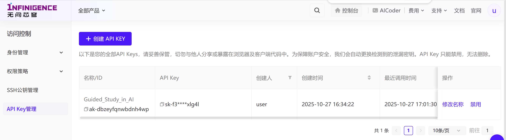
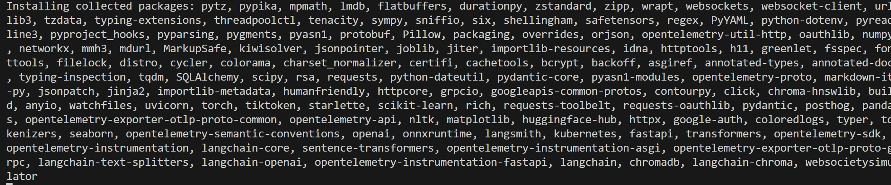
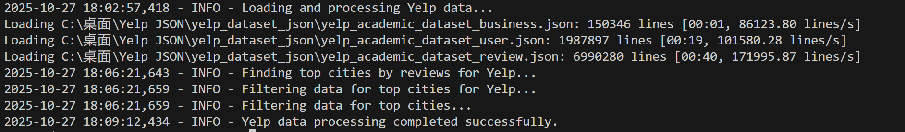

### User Behavior Modeling Track

核心思路：通过多个步骤将分散的、结构化的数据整合成一个丰满的、包含人物性格和背景故事的提示词，让模型生成高度拟人化的评论。

代码的主要逻辑可以分为以下几个部分：

##### **环境与依赖**：

-  websocietysimulator 官方用于实现 workflow 以及 evaluation 的库。
- Infinigence 无问芯穹 LLM 接口来完成推理和文本生成任务。

##### **模块定义**：

- PlanningBaseline: 获取用户信息和评价对象信息。
- ReasoningBaseline: 将接收到的任务描述直接作为提示词（Prompt）发送给大语言模型，并返回模型生成的结果。

##### **核心智能体 MySimulationAgent**：

- 这是整个脚本的核心，继承自比赛提供的 SimulationAgent 基类。
- **信息处理与描述生成**：
  - generate_user_description: 将结构化的用户信息转换成一段自然流畅的用户画像描述。
  - generate_item_description: 将结构化的评价对象信息转换成一段精准客观的介绍。
  - generate_item_review_description: 读取评价对象的所有历史评论，并生成一段对这些评论的总结摘要。
  - generate_user_review_description: 读取某个用户写过的所有历史评论，并总结出该用户的评论风格和偏好。
- **核心工作流 workflow**：
  1. **获取任务**：接收一个任务，包含 user_id和 item_id。
  2. **信息收集**：使用 interaction_tool工具获取该用户和该商户的详细信息，以及相关的历史评论。
  3. **生成画像**：调用上面提到的四个 `generate_*_description` 方法，将原始数据转换成供大语言模型理解的自然语言描述（用户画像、商户画像、评论总结等）。
  4. **构建最终提示词 (Prompt)**：将所有处理过的信息整合进一个精心设计的提示词中。这个提示词会指示大语言模型扮演一个真实用户，并基于提供的用户画像、商户情况和历史评论，为该商户撰写一篇新的评论。
  5. **生成评论**：调用 reasoning 模块（即大语言模型）来执行这个复杂的任务，生成包含星级（stars）和评论文本（review）的最终结果。
  6. **结果解析与返回**：从模型的返回结果中解析出星级和评论文本，并将其作为最终输出。

##### **模拟器运行**：

- simulator.run_simulation(...)：启动模拟过程，让智能体执行10个任务。
- simulator.evaluate()：在模拟结束后，评估智能体的表现，并将评估结果保存到 `evaluation_results_track1_yelp.json` 文件中。

##### **后续改进方向：**

1. **用户偏好建模更细致**
   当前代码只是简单地将用户历史评论和基本信息拼接给 LLM，没有做任何特征提取或偏好分析。

   - 对用户历史评论做情感分析、主题聚类，提取用户偏好标签（如喜欢安静环境、注重服务等）。
   - 统计用户评分分布，分析其评分倾向（如偏高、偏低、极端、温和等），并在 prompt 中明确告知 LLM。

2. **评论生成的多样性与真实性**

   - 增加对用户语言风格的建模（如幽默、严肃、详细、简洁等），并在 prompt 中要求 LLM模仿。
   - 可以随机采样用户历史评论片段，作为风格参考，直接拼接到 prompt 里。

3. **星级评分的合理性**
   目前星级评分完全由 LLM生成，容易出现不合理情况。

   - 先用规则或简单模型（如加权平均历史评分+商户当前评分）给出一个建议分数，再让 LLM微调。
   - 在 prompt 中明确要求“请结合你历史评分习惯，给出合理星级”。

4. **异常处理与鲁棒性**

   - 对 LLM输出做更严格的格式校验，防止星级和评论解析出错。
   - 对于无效或异常输出，自动 fallback 到默认评分或重新生成。

   - 可以把用户偏好、商户属性、评论摘要等中间结果都保存下来，方便后续分析和调优。
   - 增加日志和可视化，帮助理解 LLM决策过程。

5. **Prompt优化**

   - Prompt可以更结构化，分块描述用户、商户、历史评论、当前任务，减少冗余和歧义。
   - 可以尝试 few-shot learning，把高质量人工评论作为示例，提升生成质量。

创建密钥

安装依赖

处理数据

#### 11.3 会议展示内容

##### 1. **更真实的评分生成机制**

**问题**：评分完全依赖 LLM 输出，容易出现“中庸”或“理想化”现象。

**解决：**

- 先用规则或统计方法（如基于历史均值、当前商家均分、评论情感分析等）生成一个初步评分，再让 LLM 参考该分数生成理由和评论。
- 或者让 LLM 先生成评论，再用情感分析模型/规则从评论文本反推出评分，最后与 LLM评分做一致性校验。

#### 1. **更细致的用户画像与风格建模**
- **问题**：当前用户风格分析和历史评分模式只通过 prompt 简单引导，LLM 可能无法充分捕捉用户的真实行为习惯。
- **建议**：  
  - 统计用户历史评分的均值、方差、极端值比例等，作为 prompt 的一部分，明确告知 LLM 用户的真实打分倾向。
  - 对用户历史评论做聚类或关键词提取，提炼其常用表达、关注点，加入 prompt。
  - 可以在 `generate_user_review_description` 里增加对用户评分分布的统计描述。

#### 2. **更真实的评分生成机制**
- **问题**：评分完全依赖 LLM 输出，容易出现“中庸”或“理想化”现象。
- **建议**：  
  - 先用规则或统计方法（如基于历史均值、当前商家均分、评论情感分析等）生成一个初步评分，再让 LLM 参考该分数生成理由和评论。
  - 或者让 LLM 先生成评论，再用情感分析模型/规则从评论文本反推出评分，最后与 LLM评分做一致性校验。

#### 3. **评论内容的多样性与真实性**
- **问题**：评论容易模板化、缺乏细节，或与真实用户评论风格不符。
- **建议**：  
  - 在 prompt 中加入更多真实评论样例（few-shot），让 LLM 模仿真实用户的表达。
  - 对评论内容进行后处理，如引入随机性、插入典型用户用语、适当增加负面/正面细节。
  - 可以在 `generate_item_review_description` 和 `generate_user_review_description` 里采样真实评论片段，拼接进 prompt。

#### 4. **有用/有趣/酷等互动指标的合理性**
- **问题**：这些互动指标目前未见有明确生成逻辑，容易与真实分布偏离。
- **建议**：  
  - 统计真实数据中这些指标的分布，按用户/评论/评分类型采样生成。
  - 或者让 LLM 生成后再用规则修正（如高分评论更容易获得高“有用”数）。

#### 5. **异常处理与健壮性**
- **问题**：LLM输出格式不规范时容易报错或丢失信息。
- **建议**：  
  - 增加正则表达式或更健壮的解析逻辑，确保能从 LLM 输出中提取出评分和评论。
  - 对于异常情况，可以 fallback 到历史均值或随机生成。

#### 6. **Prompt 优化与多轮推理**
- **问题**：单轮 prompt 可能无法引导 LLM 生成更贴近真实的复杂评论。
- **建议**：  
  - 采用多轮推理（如先生成要点，再生成完整评论）。
  - 在 prompt 中明确要求模仿真实用户的风格、用词和关注点。

